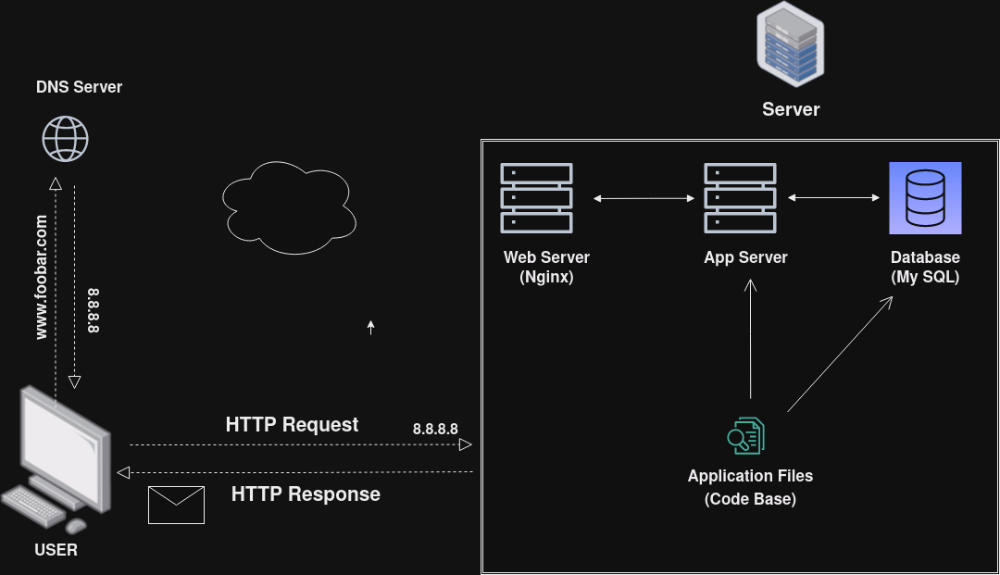

# Simple Web Stack

## Description

This is a simple web infrastructure that hosts a website that is reachable via `www.foobar.com`. There are no firewalls or SSL certificates for protecting the server's network. Each component (database, application server) has to share the resources (CPU, RAM, and SSD) provided by the server.

## Specifics About This Infrastructure

+ What a server is. A server is a computer hardware or software that provides services to other computers, which are usually referred to as *clients*.

+ The role of the domain name. To provide a human-friendly alias for an IP Address. For example, the domain name `www.foobar.com` is easier to recognize and remember than `8.8.8.8`. The IP address and domain name alias is mapped in the Domain Name System (DNS)

+ The type of DNS record `www` is in `www.foobar.com`. `www.foobar.com` uses an **A record**. This can be checked by running `dig www.foobar.com`. **Note:** the results might be different but for the infrastructure in this design, an **A** record is used. 
<i>Address Mapping record (A Record)—also known as a DNS host record, stores a hostname and its corresponding IPv4 address.</i>

+ The role of the web server. The web server is a software/hardware that accepts requests via HTTP or secure HTTP (HTTPS) and responds with the content of the requested resource or an error messsage.

+ The role of the application server. To install, operate and host applications and associated services for end users, IT services and organizations and facilitates the hosting and delivery of high-end consumer or business applications

+ The role of the database. To maintain a collection of organized information that can easily be accessed, managed and updated

+ What the server uses to communicate with the client (computer of the user requesting the website). Communication between the client and the server occurs over the internet network through the TCP/IP protocol suite.

## Issues With This Infrastructure

+ Single Point Of Failure (SPOF) in this infrastructure. Since all components are hosted on a single server, if the server goes down or experiences any issues, the entire website becomes inaccessible. This single point of failure poses a significant risk to website availability. 

+ Downtime when maintenance needed. When performing maintenance tasks, such as deploying new code or updating the web server, the website might experience downtime. During this period, users won't be able to access the website.

+ Limited Scalability: . This setup won't be able to handle large amounts of incoming traffic. As traffic increases, the server may become overloaded, causing the website to slow down or crash.

