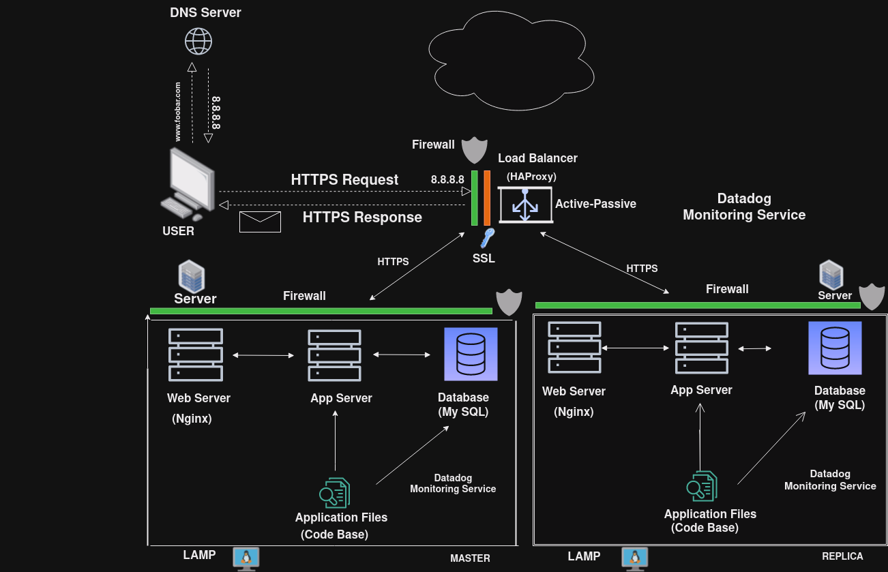

# Secured and Monitored Web Infrastructure

## Description

This is a 3-server web infrastructure that is secured, monitored, and serves encrypted traffic.

## Specifics About This Infrastructure

+ The purpose of the firewalls. Firewalls are used to control and monitor incoming and outgoing traffic to and from each server. They help protect the servers from unauthorized access, malware, and other potential security threats.
+ The purpose of the SSL Certificate and HTTPS:. An SSL certificate is used to enable HTTPS (HTTP Secure) on the web server. HTTPS encrypts the data transmitted between the user's browser and the web server, ensuring secure communication and protecting sensitive information such as login credentials and personal data.
+ The purpose of the monitoring clients. Monitoring clients or data collectors are installed on each server to collect performance metrics, log data, and other relevant information. They send this data to a central monitoring tool for analysis and alerting.

## Issues With This Infrastructure

+ Terminating SSL at the Load Balancer Level: Termination of SSL at the load balancer may expose decrypted traffic between the load balancer and the web server. If attackers gain access to this internal network, they could potentially eavesdrop on sensitive data. It's generally recommended to terminate SSL at the web server level.
+ Having one MySQL server is an issue because it is not scalable and can act as a single point of failure for the web infrastructure.
+ Having servers with all the same components would make the components contend for resources on the server like CPU, Memory, I/O, etc., which can lead to poor performance and also make it difficult to locate the source of the problem. A setup such as this is not easily scalable. 
