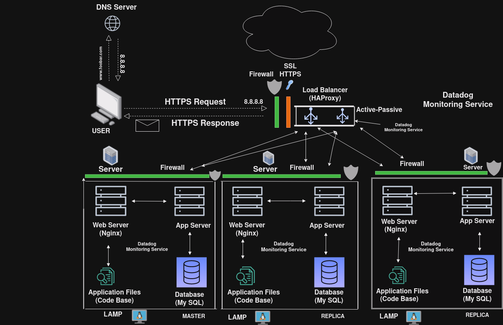

# Scaled Up Web Infrastructure

## Description

This web infrastructure is a scaled up version of the infrastructure described [here](2-secured_and_monitored_web_infrastructure.md). In this version, all SPOFs have been removed and each of the major components (web server, application server, and database servers) have been moved to separate GNU/Linux servers. The SSL protection isn't terminated at the load-balancer and each server's network is protected with a firewall and they're also monitored.

## Specifics About This Infrastructure

+ The addition of a firewall between each server. This protects each server from unwanted and unauthorized users rather than protecting a single server.

## Advantages of Splitting Components:

+ Scalability:  Each component can be scaled individually to meet the demands of the application. If one part of the system requires more resources, it can be upgraded or replicated without impacting the other components.

+ Isolation:  Separating components reduces the risk of interference or resource contention between them. For example, resource-intensive operations on the database server won't directly affect the performance of the web server or application server.

+ Modularity and Flexibility:  With separate components, you can choose different technologies or versions for each part of the system based on specific requirements.

+ Improved Performance:  Splitting components can improve the overall performance of the system by allowing specialized optimization for each component.

## Issues With This Infrastructure

+ High maintenance costs. Moving each of the major components to its own server, means that more servers would have to be bought and the company's electricity bill would rise along with the introduction of new servers. Some of the company's funds would have to be used to buy the servers and pay for the electricity consumption needed to keep the servers (including the new and old ones) running.
